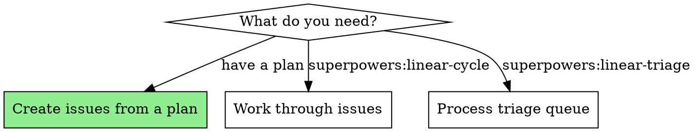
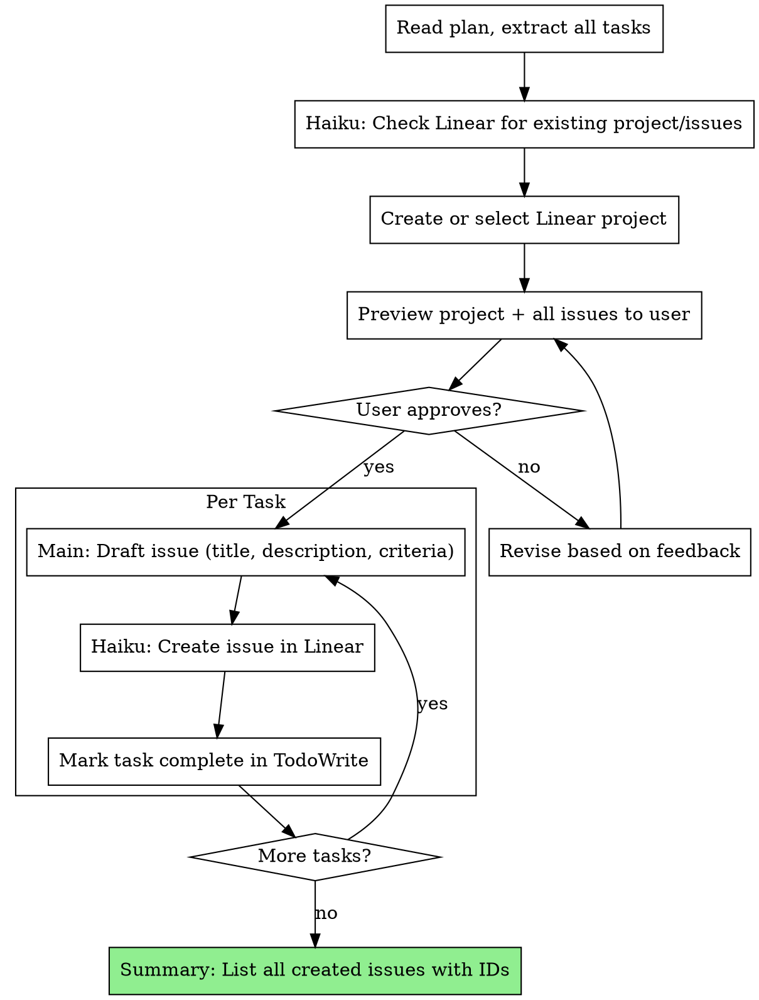

# Linear Cowork

Convert implementation plans into Linear projects and issues. This skill owns the issue-creation workflow and the shared conventions that all Linear skills follow.

**Related skills:**
- **superpowers:linear-cycle** — Loop through issues and execute them
- **superpowers:linear-triage** — Process the triage queue via brainstorming

## MCP Setup

Before using this skill, ensure the Linear MCP server is installed and authenticated. See `skills/linear-cowork/setup-guide.md` for detailed instructions.

## When to Use



## Creating Issues from Plans

**Announce at start:** "I'm using the linear-cowork skill to create Linear issues from this plan."

### The Process



## Step-by-Step

### Step 1: Load Plan and Extract Tasks

1. Read the plan file
2. Extract every task with its full text, steps, files, and acceptance criteria
3. Create a TodoWrite with all tasks
4. Note the plan's Goal, Architecture, and Tech Stack for project context

### Step 2: Check Linear Context (Haiku Subagent)

Dispatch a Haiku subagent to:
- List existing projects on the team — check if one already covers this work
- List recent issues — check for duplicates
- Get team context (team ID, available labels, members)

### Step 3: Create or Select Linear Project

If a matching project exists, use it. Otherwise, create a new project:
- **Name:** The plan's feature name
- **Description:** The plan's Goal + Architecture summary
- **Status:** "Planned" or "In Progress"

Use a Haiku subagent for the API call.

### Step 4: Preview All Issues

Before creating anything, draft and present ALL issues to the user in a single preview:

```markdown
## Linear Project: [Project Name]

### Issue 1: [Feature] Add user authentication
**Priority:** Medium | **Label:** Feature | **Status:** Todo | **Assignee:** me
**Description:**
## Background
[From plan task context]
## Acceptance Criteria
- [ ] [From plan task steps]

---

### Issue 2: [Feature] Add session management
...
```

**Wait for user approval before creating any issues.** The user may want to:
- Adjust titles or descriptions
- Change priorities
- Remove or combine tasks
- Add additional context

### Step 5: Create Issues (Per Task)

For each approved task, sequentially:

1. **Main model** drafts the issue content:
   - Title following `[Type] Short description` convention
   - Description with Background + Acceptance Criteria sections
   - Acceptance criteria derived from the plan's task steps
   - Map plan task type to label (Feature/Bug/Improvement)
   - Priority defaults to Medium (3) unless plan indicates otherwise

2. **Haiku subagent** creates the issue in Linear:
   - Set title, description, label, priority, status (Todo), assignee (me)
   - Add to the project
   - Return the issue ID

3. Mark the task complete in TodoWrite

### Step 6: Summary

After all issues are created, present a summary:

```markdown
## Created Linear Project: [Name]

| # | Issue ID | Title | Priority | Label |
|---|----------|-------|----------|-------|
| 1 | ONE-42 | [Feature] Add user auth | Medium | Feature |
| 2 | ONE-43 | [Feature] Add sessions | Medium | Feature |
| 3 | ONE-44 | [Chore] Set up CI pipeline | Medium | Improvement |

Project URL: [link]
```

## Issue Conventions

### Naming Rule

All issue titles MUST follow this format:

```
[Type] Short description
```

| Type | When to use |
|------|-------------|
| `[Feature]` | New functionality |
| `[Bug]` | Bug fix |
| `[Chore]` | Maintenance, dependencies, config |
| `[Refactor]` | Code restructuring without behavior change |
| `[Docs]` | Documentation changes |

### Description Template

Every issue description MUST include:

```markdown
## Background
[Why this issue exists. What problem it solves. Context from the plan.]

## Acceptance Criteria
- [ ] [Derived from plan task steps — specific, testable]
- [ ] [Another criterion]
```

### Mapping Plan Tasks to Issues

Each plan task becomes one Linear issue. The mapping:

| Plan Element | Issue Field |
|-------------|-------------|
| Task name | Title (with `[Type]` prefix) |
| Task context + plan Goal | Background section |
| Task steps + verifications | Acceptance Criteria |
| Task type (new feature, fix, etc.) | Label (Feature/Bug/Improvement) |
| Plan priority hints | Priority (default Medium) |

### Labels

| Label | Color | When to use |
|-------|-------|-------------|
| Feature | purple | New functionality (`[Feature]` issues) |
| Bug | red | Bug fixes (`[Bug]` issues) |
| Improvement | blue | Enhancements, refactors, chores, docs |

### Priority

Default to **Medium (3)** unless the plan or user specifies otherwise.

| Value | Level | When to use |
|-------|-------|-------------|
| 1 | Urgent | Production down, data loss, security vulnerability |
| 2 | High | Blocks other work, major user-facing issue |
| 3 | Medium | Default — standard feature work, normal bugs |
| 4 | Low | Nice-to-have, minor polish, tech debt |

### Default Assignment

Assign all issues to "me" (the current authenticated user) unless the user specifies otherwise.

### Status

All new issues default to **Todo**. Do not set to Backlog unless the user requests it.

## Subagent Strategy

| Task | Model | Why |
|------|-------|-----|
| Read from Linear (projects, issues, team) | Haiku subagent | Cheap, fast, repetitive |
| Write to Linear (create project/issues) | Haiku subagent | Simple API calls |
| Explore codebase for issue context | Explore subagent | Efficient file search |
| Draft issue content (title, description, criteria) | Main model | Requires quality writing |

**Key rules:**
- Always preview ALL issue content before submission
- Simple reads and writes go through Haiku to save context tokens
- Content that users will see must be drafted by the main model for quality
- One issue created at a time (sequential, not parallel) to maintain ordering

## Red Flags

**Never:**
- Create issues without user preview and approval
- Skip the Background or Acceptance Criteria sections
- Use Backlog status for new issues (use Todo)
- Create duplicate issues without checking existing ones first
- Skip the project creation step when plan has 3+ tasks
- Guess at team IDs or label IDs — always read from Linear first
- Create all issues in parallel (ordering matters for dependencies)

## Quick Reference

| Action | Rule |
|--------|------|
| Trigger | Have a plan, want issues not code |
| Issue title | `[Type] Short description` |
| Issue description | Background + Acceptance Criteria from plan |
| Assign issue | Default to "me" |
| Label | Auto-apply: Feature / Bug / Improvement |
| Priority | Default to Medium (3) |
| New issue status | Todo |
| Project | Create if 3+ issues, reuse if exists |
| Preview | Required before creating any issues |
| Read/write Linear | Haiku subagent |
| Draft issue content | Main model |
