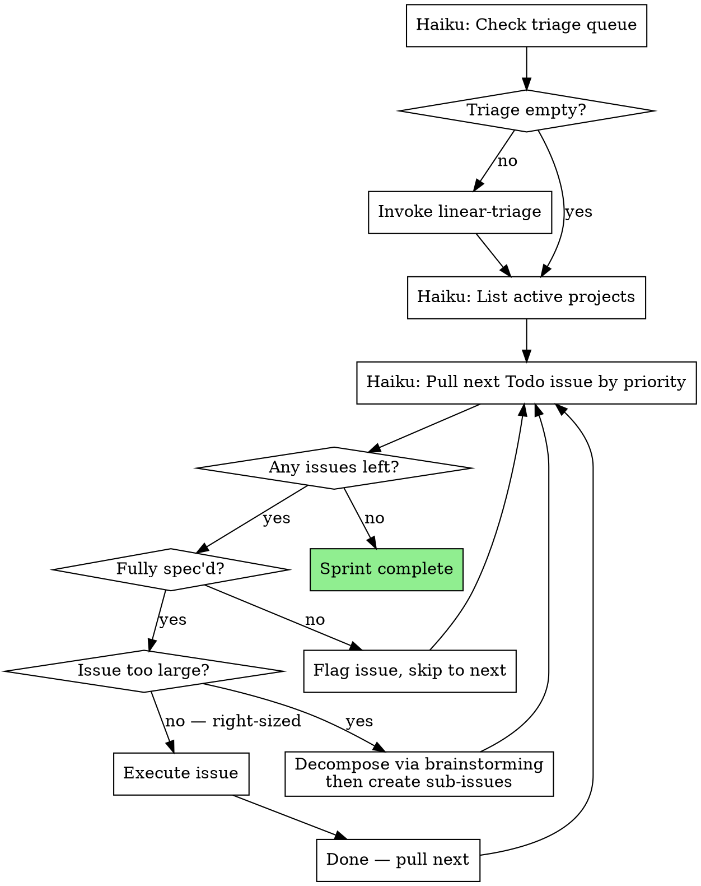

# Linear Cycle

Work through Linear issues in a continuous loop. Pull the highest-priority fully spec'd issue, execute it, then pull the next one. Issues that are missing details get flagged and skipped — never block the cycle on an incomplete issue.

**Announce at start:** "I'm using the linear-cycle skill to work through Linear issues."

## The Loop

## Step-by-Step

### Step 1: Clear Triage First

Dispatch a Haiku subagent to check the team's triage queue. If items exist, invoke **superpowers:linear-triage** to process them before starting the cycle. The cycle does not begin until triage is empty.

### Step 2: Review Active Projects

Dispatch a Haiku subagent to list active Linear projects. This informs priority decisions throughout the cycle:

- Issues in **in-progress projects** get a priority boost
- Within the same priority level, prefer issues that unblock other work

Keep project context in mind for the entire cycle, not just the first issue.

### Step 3: Pull Next Issue

Dispatch a Haiku subagent to get the highest-priority **Todo** issue, factoring in project context. If no Todo issues remain, the cycle is complete.

### Step 4: Spec Check

Before executing, verify the issue is fully spec'd. A fully spec'd issue has:

- A clear title with `[Type]` prefix
- A **Background** section explaining context
- **Acceptance Criteria** with specific, testable items

**If incomplete:** Flag the issue and skip it:
1. Add a `needs-spec` label (or equivalent) via Haiku subagent
2. Add a comment: *"Flagged during cycle — missing [Background/Acceptance Criteria/specific criteria]. Needs brainstorming before implementation."*
3. Move to **Backlog** status (it's not ready for Todo)
4. Tell the user: *"ONE-42 is missing acceptance criteria — flagged for triage. Moving to next issue."*
5. Pull the next issue (Step 3)

### Step 5: Size Check

Assess whether the issue is right-sized (single branch/PR, clear scope).

**If too large:**
1. Invoke **superpowers:brainstorming** to design the decomposition
2. Create sub-issues in Linear via **superpowers:linear-cowork** (Part 2)
3. Update the parent issue to reference sub-issues
4. Pull the next issue (Step 3) — the sub-issues are now in the queue

### Step 6: Execute

Hand off to:
- **superpowers:subagent-driven-development** (if subagents available)
- **superpowers:executing-plans** (if no subagents)

One issue = one branch = one PR.

### Step 7: Pull Next

After execution completes and the issue is marked Done, return to **Step 3** and pull the next highest-priority issue.

Continue until:
- No more Todo issues remain
- The user says to stop

## Priority Order

Issues are pulled in strict priority order:

1. **Urgent (1)** — Always first
2. **High (2)** — Blocks other work
3. **Medium (3)** — Standard work
4. **Low (4)** — Nice-to-have

Within the same priority level:
- Issues in **in-progress projects** come first
- Issues that **unblock other issues** come first
- Otherwise, oldest first

## What Makes an Issue "Fully Spec'd"

| Element | Required | What to check |
|---------|----------|---------------|
| Title | `[Type] description` | Has bracket prefix, descriptive |
| Background | Non-empty section | Explains why the issue exists |
| Acceptance Criteria | 1+ testable items | Each criterion is specific and verifiable |
| Labels | At least one | Feature / Bug / Improvement |
| Priority | Set | Not "No priority" |

If any required element is missing, the issue is **not ready** and gets flagged.

## Red Flags

**Never:**
- Execute an issue that's missing acceptance criteria
- Block the cycle waiting for a spec — flag and skip
- Combine multiple issues into one branch
- Skip triage at the start of a cycle
- Ignore project context when prioritizing

## Quick Reference

| Action | Rule |
|--------|------|
| Start cycle | Clear triage first via linear-triage |
| Pull order | Priority, then project context, then age |
| Incomplete issue | Flag with `needs-spec`, move to Backlog, skip |
| Large issue | Decompose via brainstorming, create sub-issues |
| Execute | One issue per branch per PR |
| After each issue | Pull next by priority |
| Stop when | No Todo issues left or user says stop |
