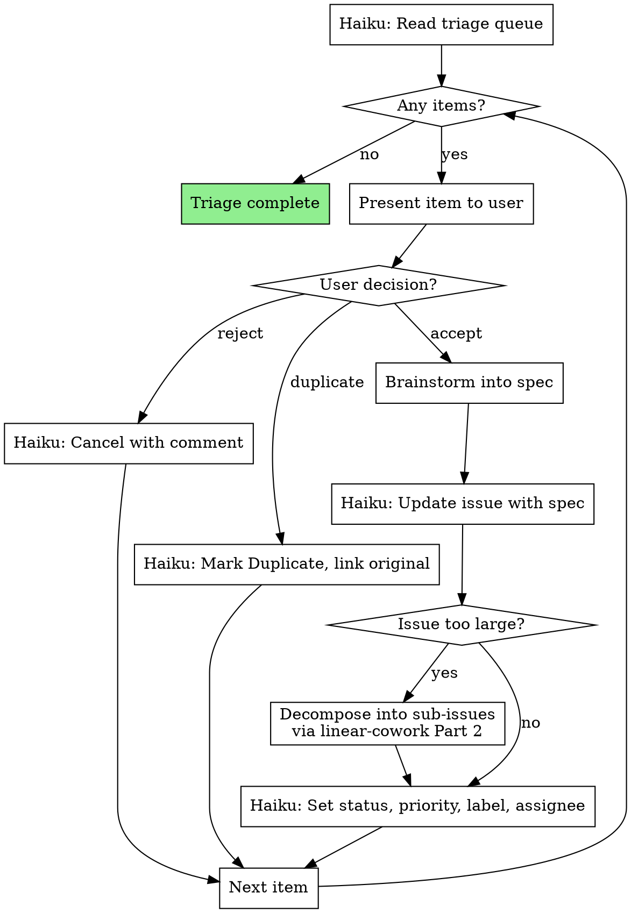

# Linear Triage

Process the Linear triage queue by brainstorming each item into a fully spec'd issue. Every triage item leaves this skill with a clear title, background, acceptance criteria, label, and priority — or gets rejected/merged as a duplicate.

**Announce at start:** "I'm using the linear-triage skill to process the triage queue."

## The Process



## Step-by-Step

### Step 1: Read the Triage Queue

Dispatch a Haiku subagent to list all issues in triage (issues without a status or in the triage/inbox state). Present the full queue to the user:

```markdown
## Triage Queue (N items)

| # | Title | Reporter | Created | Summary |
|---|-------|----------|---------|---------|
| 1 | Login fails on Safari | Jane | 2 days ago | Users report blank screen after OAuth redirect |
| 2 | Add dark mode | Bob | 1 week ago | Feature request from customer feedback |
| 3 | Upgrade React | — | 3 days ago | Currently on v18, v19 is stable |
```

### Step 2: Process Each Item

For each triage item, present it to the user and ask for a decision:

**Accept** — The item is real work. Proceed to brainstorming (Step 3).

**Reject** — The item won't be done. Use a Haiku subagent to:
- Set status to **Canceled**
- Add a comment explaining why (e.g., "Won't fix — edge case with no user impact")

**Duplicate** — Already covered by another issue. Use a Haiku subagent to:
- Set status to **Duplicate**
- Link to the existing issue
- Add a comment: "Duplicate of ONE-XX"

### Step 3: Brainstorm into a Spec

For accepted items, run a focused brainstorming session to produce a complete issue spec. This is a lightweight version of **superpowers:brainstorming** — not a full design process, but enough to produce:

1. **Title** with proper `[Type]` prefix
2. **Background** — why this issue exists, what problem it solves
3. **Acceptance Criteria** — specific, testable items

**Brainstorming for triage is conversational and quick:**

- Explore codebase context if needed (Explore subagent)
- Ask the user 1-3 clarifying questions to understand scope
- Draft the spec and present for approval

```markdown
### ONE-42: Login fails on Safari

**Proposed title:** [Bug] Fix blank screen after OAuth redirect on Safari

**Background:**
Users on Safari report a blank white screen after completing the OAuth
login flow. The redirect callback fails to parse the auth token because
Safari strips the URL fragment on certain redirect types.

**Acceptance Criteria:**
- [ ] OAuth redirect works on Safari 17+ (desktop and iOS)
- [ ] Auth token is correctly parsed from callback URL on all major browsers
- [ ] Add Safari to the browser test matrix in CI

**Priority:** High | **Label:** Bug | **Assignee:** me
```

Wait for user approval before updating the issue.

### Step 4: Update the Issue

After user approves, use a Haiku subagent to:
- Update the title to the approved format
- Replace the description with the Background + Acceptance Criteria
- Set the label (Feature / Bug / Improvement)
- Set the priority (default Medium unless brainstorming suggests otherwise)
- Set the assignee (default "me")

### Step 5: Size Check

If the brainstormed spec reveals the issue is too large for a single branch/PR:
1. Use **superpowers:linear-cowork** (Part 2) to decompose into sub-issues
2. Update the parent issue to reference the sub-issues
3. Set the parent to an appropriate status

### Step 6: Set Status

For right-sized issues:
- Set to **Todo** — the issue is now ready to be pulled in a cycle
- Set to **Backlog** — if the user wants to defer it

### Step 7: Next Item

Move to the next triage item. Continue until the queue is empty.

## What "Fully Spec'd" Means

Every issue leaving triage must have:

| Element | Required format |
|---------|----------------|
| Title | `[Type] Short description` |
| Background | Why this issue exists, context |
| Acceptance Criteria | 1+ specific, testable items |
| Label | Feature / Bug / Improvement |
| Priority | Urgent / High / Medium / Low |
| Assignee | Set (default "me") |
| Status | Todo or Backlog (never remains in triage) |

## Subagent Strategy

| Task | Model |
|------|-------|
| Read triage queue | Haiku subagent |
| Update issues (status, labels, comments) | Haiku subagent |
| Explore codebase for context | Explore subagent |
| Brainstorm spec content | Main model |

## Red Flags

**Never:**
- Leave a triage item in triage — every item gets a decision
- Skip acceptance criteria — even "obvious" bugs need testable criteria
- Accept an item without brainstorming it into a proper spec
- Auto-reject items without user input
- Set accepted items to Backlog without asking the user

## Quick Reference

| Action | Rule |
|--------|------|
| Each triage item | User decides: accept, reject, or duplicate |
| Accepted items | Brainstorm into full spec (title, background, criteria) |
| Rejected items | Cancel with explanation comment |
| Duplicates | Mark duplicate, link to original |
| After spec | Set priority, label, assignee, status (Todo or Backlog) |
| Large items | Decompose into sub-issues via linear-cowork |
| Goal | Empty triage queue, every item fully spec'd or resolved |
