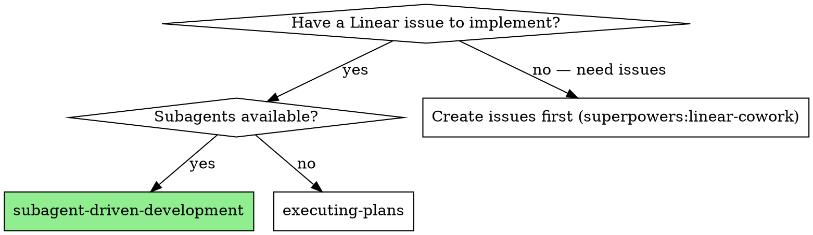
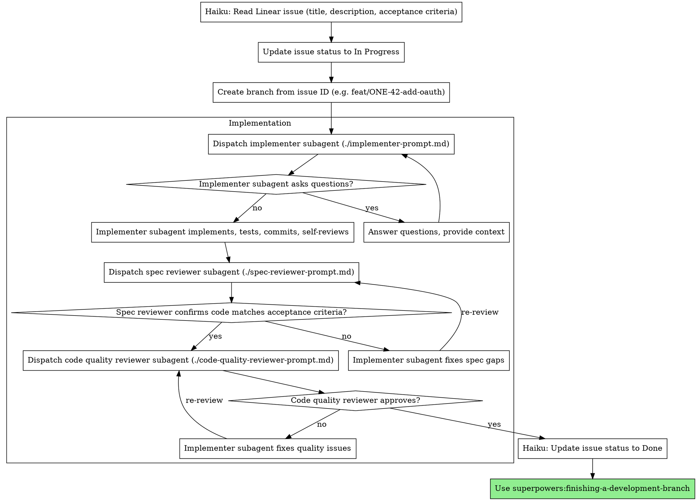

# Subagent-Driven Development

Execute a single Linear issue by dispatching a fresh subagent, with two-stage review: spec compliance first, then code quality. **One issue = one branch = one PR.**

**Core principle:** Linear is the source of truth. Each issue is implemented in isolation on its own branch, reviewed, and submitted as a single PR.

## When to Use



## The Process



## Step-by-Step

### Step 1: Read the Linear Issue (Haiku Subagent)

Dispatch a Haiku subagent to read the issue from Linear:
- Title, description, acceptance criteria
- Labels, priority, assignee
- Project context and related issues

The issue's **Acceptance Criteria** are the spec for the implementer. Do NOT read from a plan file — the Linear issue is the source of truth.

### Step 2: Update Status to In Progress

Use a Haiku subagent to update the issue status to **In Progress**.

### Step 3: Create Branch

Create a branch named after the issue:
```
feat/ONE-42-short-description
fix/ONE-43-crash-on-empty-cart
chore/ONE-44-upgrade-react
```

### Step 4: Dispatch Implementer

Provide the implementer subagent with:
- The full issue title and description (from Linear, not a plan file)
- Acceptance criteria as the spec to implement against
- Relevant codebase context (gathered via Explore subagent if needed)

### Step 5: Two-Stage Review

After implementation:
1. **Spec compliance review** — does the code satisfy every acceptance criterion from the issue?
2. **Code quality review** — is the implementation well-built?

Review loops until both pass.

### Step 6: Update Issue to Done

Use a Haiku subagent to update the issue status to **Done**.

### Step 7: Finish Branch

Use superpowers:finishing-a-development-branch to create the PR.

Include the issue ID in the PR title: `[ONE-42] Add OAuth login flow`

### After Completion

Let the user know: *"Issue ONE-42 is done. Use superpowers:linear-cowork to pull the next issue when you're ready."*

## Model Selection

Use the least powerful model that can handle each role:

**Mechanical implementation tasks** (isolated functions, clear specs, 1-2 files): use a fast, cheap model.

**Integration and judgment tasks** (multi-file coordination, pattern matching, debugging): use a standard model.

**Architecture, design, and review tasks**: use the most capable available model.

## Handling Implementer Status

**DONE:** Proceed to spec compliance review.

**DONE_WITH_CONCERNS:** Read concerns before proceeding. If about correctness or scope, address first. If observations, note and proceed.

**NEEDS_CONTEXT:** Provide missing context and re-dispatch.

**BLOCKED:** Assess the blocker:
1. Context problem → provide more context, re-dispatch
2. Needs more reasoning → re-dispatch with more capable model
3. Task too large → break into smaller pieces (create sub-issues in Linear)
4. Plan is wrong → escalate to the human

## Branch and PR Conventions

**One issue = one branch = one PR.** Never combine multiple issues into a single branch.

- Branch name: `{type}/ISSUE-ID-short-description`
- Commit messages: `[ISSUE-ID] description`
- PR title: `[ISSUE-ID] Issue title`

## Prompt Templates

- `./implementer-prompt.md` - Dispatch implementer subagent
- `./spec-reviewer-prompt.md` - Dispatch spec compliance reviewer subagent
- `./code-quality-reviewer-prompt.md` - Dispatch code quality reviewer subagent

## Red Flags

**Never:**
- Start from a plan file instead of a Linear issue
- Combine multiple issues into one branch or PR
- Start implementation on main/master without explicit user consent
- Skip reviews (spec compliance OR code quality)
- Proceed with unfixed review issues
- Ignore subagent questions
- Skip the re-review after fixes
- **Start code quality review before spec compliance is approved**

**If subagent asks questions:** Answer clearly and completely.

**If reviewer finds issues:** Implementer fixes, reviewer re-reviews, repeat until approved.

**If subagent fails:** Dispatch fix subagent with specific instructions. Don't fix manually (context pollution).

## Integration

**Required workflow skills:**
- **superpowers:using-git-worktrees** - REQUIRED: Set up isolated workspace before starting
- **superpowers:linear-cowork** - Creates the Linear issues this skill implements
- **superpowers:requesting-code-review** - Code review template for reviewer subagents
- **superpowers:finishing-a-development-branch** - Complete development, create PR

**Subagents should use:**
- **superpowers:test-driven-development** - Subagents follow TDD for each task

**Alternative workflow:**
- **superpowers:executing-plans** - Use when subagents are not available
